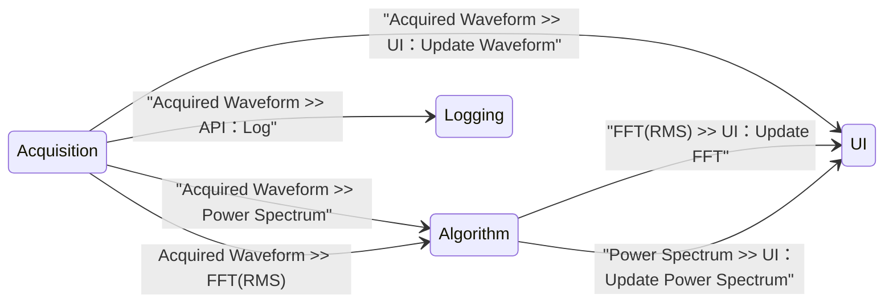

# CSM Continuous Measurement and Logging

[English](./README.md) | [中文](./README(CN).md)

[](https://www.vipm.io/package/nevstop_lib_csm_continuous_meausrement_and_logging_example/)
[](https://www.vipm.io/package/nevstop_lib_csm_continuous_meausrement_and_logging_example/)
[](https://github.com/NEVSTOP-LAB/CSM-Continuous-Meausrement-and-Logging/releases)
[](https://opensource.org/licenses/Apache-2.0)

基于 CSM（可通信状态机）框架更简单、更直观、更优雅地实现连续测量和记录应用的示例。

## 可复用模块

### `Logging Module` : 将1D波形数据记录到TDMS文件中

| API | 描述 | 参数 | 响应 |
| --- | --- | --- | --- | 
| `API: Update Settings` | 配置API | 数据文件夹的完整路径 <br/> (类型: 普通字符串)| N/A |
| `API: Start` | 开始记录。在数据文件夹中创建基于时间的文件名的TDMS文件。 | N/A | N/A |
| `API: Log` | 将数据记录到TDMS文件中。 | 1D波形数组。 <br/> (类型: `massdata`) | N/A |
| `API: Stop` | 停止记录。 | N/A | N/A |

**示例：（假设模块名称为“Logging”）**

``` text
API: Update Settings >> c:\_data -> Logging
API: Log >> MassData-Start:89012,Size:1156 -> Logging
API: Start -> Logging
API: Stop -> Logging
```
												   
### DAQ模块

| API | 描述 | 参数 | 响应 |
| --- | --- | --- | --- |
| `API: Start` | 开始每200毫秒生成数据。 | N/A | N/A |
| `API: Stop` | 停止数据生成。 | N/A | N/A |

| Status | 描述 | 参数 |
| --- | --- | --- |
| Acquired Waveform | 模拟生成的数据  | 1D波形数组. <br/> (类型: MassData) |

模块的前面板(Front Panel)用于参数配置。

#### `Acquisition Module`: 生成正弦/方波模拟信号数据


#### `SoundInput-DAQ`: 使用声卡采集波形数据


**示例：（假设模块名称为“Acquisition”）**

``` text
API: Start -> Acquisition
API: Stop -> Acquisition
```

### `Algorithm Module`: 波形数据分析模块

| API | 描述 | 参数 | 响应 |
| --- | --- | --- | --- |
| `API: FFT(Peak)` | FFT(peak) 分析方法 | 1D波形数组. <br/> (类型: MassData) | Cluster波形数组. <br/> (类型: MassData) |
| `API: FFT(RMS)` | FFT(RMS) 分析方法 | 1D波形数组. <br/> (类型: MassData) | Cluster波形数组. <br/> (类型: MassData) |
| `API: Power Spectrum` | Power Spectrum 分析方法 | 1D波形数组. <br/> (类型: MassData) | Cluster波形数组. <br/> (类型: MassData) |

## 连续测量和记录应用程序

"Logging Module" 和 "Acquisition Module" 是设计为完全独立工作的，彼此之间没有直接联系。为了创建完整的连续测量和记录应用，需要一个用户界面模块来协调这两个底层模块的工作。为了简化实现（并便于与Workers框架进行比较），用户界面模块同时也充当应用程序的控制器。

当需要使用真实硬件进行数据采集时，可以为您的特定硬件创建另一个具有相同 API 和状态接口的 CSM 模块，然后替换 UI 模块中的 Acquisition Module。这样可以轻松切换和集成不同的硬件模块，而无需更改 UI 模块的其余部分，因为它们遵循相同的 API 和状态接口。

### 用户界面模块

创建一个类似于 [Workers Continuous Measurement and Logging Example](https://www.vipm.io/package/sc_workers_framework_core/) 的用户界面。


使用 CSM 模板创建程序框图，将 "Logging Module" 和 "Acquisition Module" 作为子模块放置在 VI 后面板。



