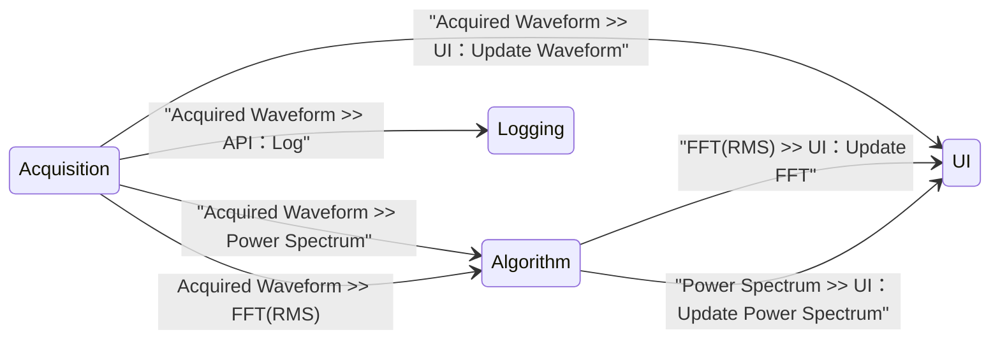

# CSM Continuous Measurement and Logging

[English](./README.md) | [中文](./README(CN).md)

[](https://www.vipm.io/package/nevstop_lib_csm_continuous_meausrement_and_logging_example/)
[](https://www.vipm.io/package/nevstop_lib_csm_continuous_meausrement_and_logging_example/)
[](https://github.com/NEVSTOP-LAB/CSM-Continuous-Meausrement-and-Logging/releases)
[](https://opensource.org/licenses/Apache-2.0)

基于 CSM 框架更简单、更直观，更优雅的实现连续测量和记录应用的示例。

## 可复用的底层模块

### `Logging Module` : 将1D波形数据记录到TDMS文件中

| API | 描述 | 参数 | 响应 |
| --- | --- | --- | --- | 
| `API: Update Settings` | 配置API | 数据文件夹的完整路径 <br/> (类型: 普通字符串)| N/A |
| `API: Start` | 开始记录。在数据文件夹中创建基于时间的文件名的TDMS文件。 | N/A | N/A |
| `API: Log` | 将数据记录到TDMS文件中。 | 1D波形数组。 <br/> (类型: (Type: `massdata`) | N/A |
| `API: Stop` | 停止记录。 | N/A | N/A |

**示例：（假设模块名称为“Logging”）**

``` text
API: Update Settings >> c:\_data -> Logging
API: Log >> MassData-Start:89012,Size:1156 -> Logging
API: Start -> Logging
API: Stop -> Logging
```
												   
### 数据采集模块

| API | 描述 | 参数 | 响应 |
| --- | --- | --- | --- |
| `API: Start` | 开始每200毫秒生成数据。 | N/A | N/A |
| `API: Stop` | Stop data generation. | N/A | N/A |

| Status | 描述 | 参数 |
| --- | --- | --- | --- |
| Acquired Waveform | 模拟生成的数据  | 1D波形数组. <br/> (类型: MassData) |

模块前面板(front Panel)用于配置参数。

#### `Acquisition Module` : 生成正弦/方波模拟信号数据


#### `SoundInput-DAQ` : 采集声卡信号模块


**示例：（假设模块名称为“Acquisition”）**

``` text
API: Start -> Acquisition
API: Stop -> Acquisition
```

### `Algorithm Module` : 波形数据的分析模块

| API | 描述 | 参数 | 响应 |
| --- | --- | --- | --- |
| `API: FFT(Peak)` | FFT(peak) 分析方法 | 1D波形数组. <br/> (类型: MassData) | Cluster波形数组. <br/> (类型: MassData) |
| `API: FFT(RMS)` | FFT(RMS) 分析方法 | HW:(string);Signal Type:(Sine Wave \| 1D波形数组. <br/> (类型: MassData) | Cluster波形数组. <br/> (类型: MassData) |
| `API: Power Spectrum` | Power Spectrum 分析方法 | 1D波形数组. <br/> (类型: MassData) | Cluster波形数组. <br/> (类型: MassData) |

## 连续测量和记录应用程序

可以看出，"Logging Module" 和 "Acquisition Module" 设计完成时，完全不知道彼此的存在。为了创建连续测量和记录应用程序，除了需要一个用户界面模块。还需要调度这两个底层模块协同工作。为了简单，用户界面模块也作为 Controller，承担调度工作。

当需要使用真实硬件进行数据采集时，可以创建另一个 CSM 模块，该模块具有相同的 API 和状态，然后将其替换掉 UI 模块中的 Acquisition Module。这将允许轻松地切换并集成不同的硬件模块，而不必更改 UI 模块的其余部分，因为它们遵循相同的 API 和状态接口。

### 用户界面模块

参考 [Workers Continuous Measurement and Logging Example](https://www.vipm.io/package/sc_workers_framework_core/) 创建用户界面.


使用 CSM 模板创建块图，将 "Logging Module" 和 "Acquisition Module" 作为子模块放置在VI后面板。



