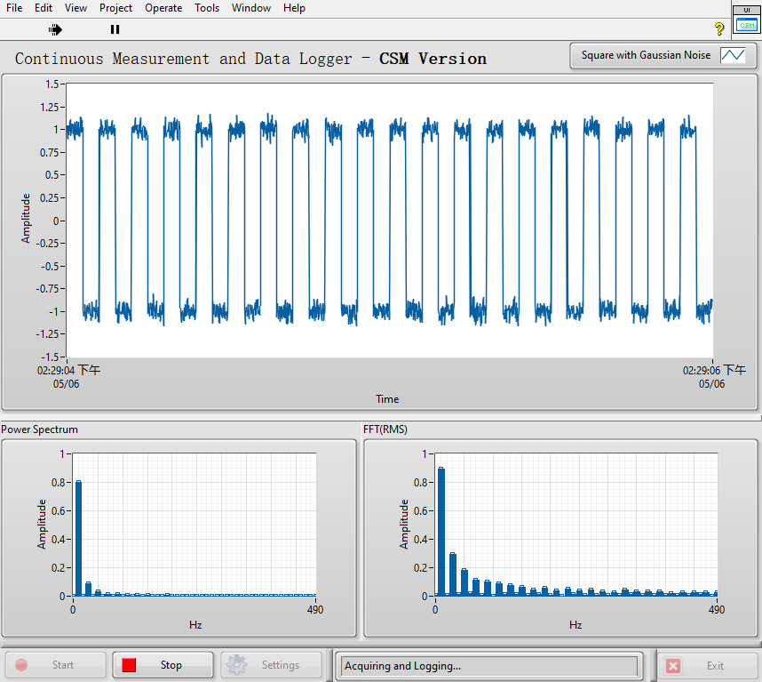
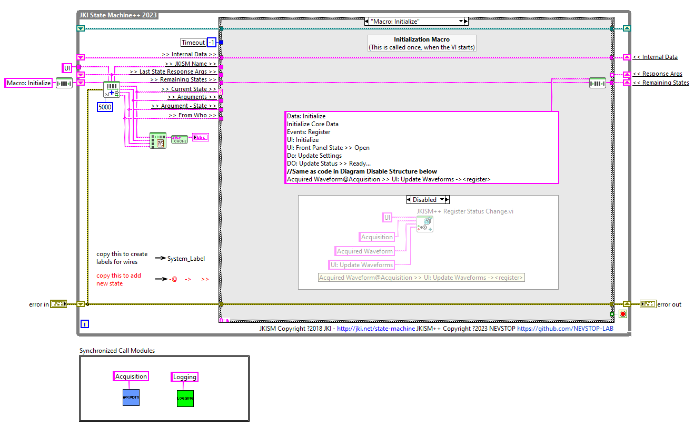
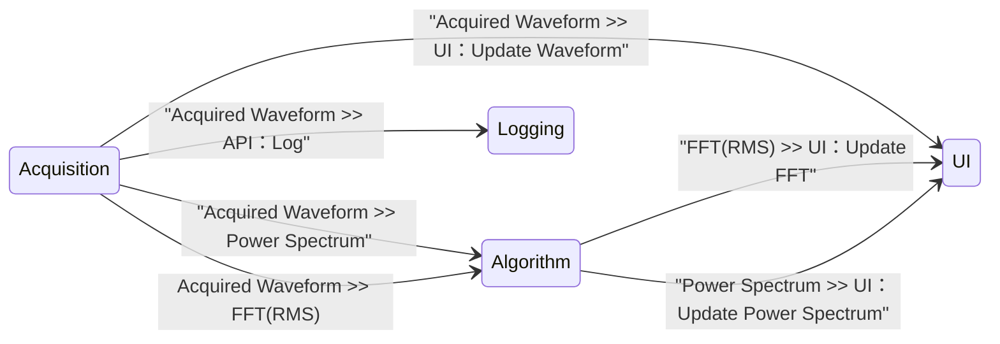

# CSM Continuous Measurement and Logging

[English](./README.md) | [中文](./README(CN).md)

[](https://www.vipm.io/package/nevstop_lib_csm_continuous_meausrement_and_logging_example/)
[](https://www.vipm.io/package/nevstop_lib_csm_continuous_meausrement_and_logging_example/)
[](https://github.com/NEVSTOP-LAB/CSM-Continuous-Meausrement-and-Logging/releases)
[](https://opensource.org/licenses/Apache-2.0)

基于 CSM（可通信状态机）框架，以更简单、更直观、更优雅的方式构建连续测量与记录应用的示例项目。

## 可复用模块

### `Logging Module`: 将 1D 波形数据记录到 TDMS 文件

| API | 描述 | 参数 | 响应 |
| --- | --- | --- | --- |
| `API: Update Settings` | 配置 API | 数据文件夹的完整路径 <br/> (类型: 普通字符串) | N/A |
| `API: Start` | 开始记录。在数据文件夹中创建以时间命名的 TDMS 文件。 | N/A | N/A |
| `API: Log` | 将数据写入 TDMS 文件。 | 1D 波形数组 <br/> (类型: `massdata`) | N/A |
| `API: Stop` | 停止记录。 | N/A | N/A |

**示例：（假设模块名称为“Logging”）**

``` text
API: Update Settings >> c:\_data -> Logging
API: Log >> MassData-Start:89012,Size:1156 -> Logging
API: Start -> Logging
API: Stop -> Logging
```

### `DAQ 模块`: 采集波形数据

| API | 描述 | 参数 | 响应 |
| --- | --- | --- | --- |
| `API: Start` | 每 200ms 生成一次数据。 | N/A | N/A |
| `API: Stop` | 停止数据生成。 | N/A | N/A |

| Status | 描述 | 参数 |
| --- | --- | --- |
| Acquired Waveform | 模拟生成的波形数据 | 1D 波形数组 <br/> (类型: MassData) |

模块 VI 的前面板用于参数配置。

#### `Acquisition Module`: 生成正弦/方波模拟信号数据


#### `SoundInput-DAQ`: 使用声卡采集波形数据。


**示例：（假设模块名称为“Acquisition”）**

``` text
API: Start -> Acquisition
API: Stop -> Acquisition
```

### `Algorithm Module`: 波形数据分析算法

| API | 描述 | 参数 | 响应 |
| --- | --- | --- | --- |
| `API: FFT(Peak)` | 使用 FFT(Peak) 方法分析波形数据 | 1D 波形数组 <br/> (类型: MassData) | 1D Cluster 波形数组 <br/> (类型: MassData) |
| `API: FFT(RMS)` | 使用 FFT(RMS) 方法分析波形数据 | 1D 波形数组 <br/> (类型: MassData) | 1D Cluster 波形数组 <br/> (类型: MassData) |
| `API: Power Spectrum` | 获取波形的功率谱 | 1D 波形数组 <br/> (类型: MassData) | 1D Cluster 波形数组 <br/> (类型: MassData) |

## 连续测量与记录应用

`Logging Module` 与 `Acquisition Module` 被设计为完全独立运行，彼此之间没有直接依赖。为了构建完整的连续测量与记录应用，需要一个用户界面模块来协调两者的工作。为简化实现（也便于与 Workers 框架进行对比），UI 模块同时承担应用控制器的职责。

当需要使用真实硬件进行数据采集时，只需为目标硬件创建一个实现相同 API 和状态接口的 CSM 模块，然后在 UI 模块中替换 `Acquisition Module` 即可。由于接口保持一致，UI 模块的其余部分无需任何修改。

### 用户界面（UI）模块

创建一个类似于 [Workers Continuous Measurement and Logging Example](https://www.vipm.io/package/sc_workers_framework_core/) 的用户界面。



使用 CSM 模板创建程序框图，将 `Logging Module` 和 `Acquisition Module` 作为子模块放置其中。




``` mermaid
stateDiagram-v2
direction LR
Acquisition --> Algorithm : "Acquired Waveform >> Power Spectrum"
Acquisition --> Algorithm : Acquired Waveform >> FFT(RMS)
Acquisition --> Logging  : "Acquired Waveform >> API：Log"
Acquisition --> UI : "Acquired Waveform >> UI：Update Waveform"
Algorithm --> UI : "FFT(RMS) >> UI：Update FFT"
Algorithm --> UI : "Power Spectrum >> UI：Update Power Spectrum"
```
