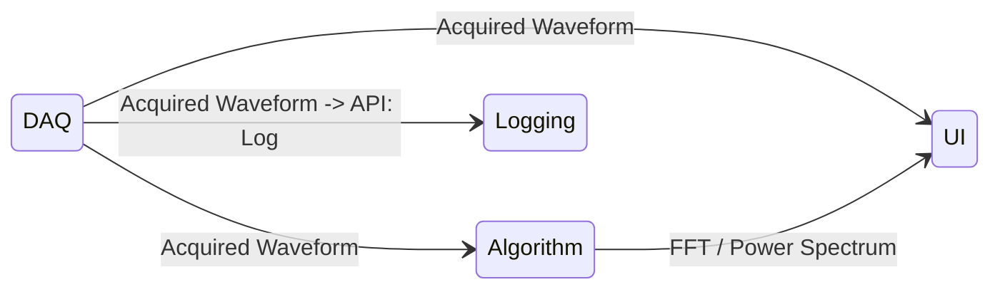

# CSM Continuous Measurement and Logging

[English](./README.md) | [中文](./README(CN).md)

基于 CSM（可通信状态机）框架的连续测量与记录示例，重点展示模块解耦、可替换采集源与可扩展的数据处理链路。

## 本仓库体现的 CSM 优势

- **低耦合**：采集、算法、记录、UI 通过消息/状态协作，不直接绑定彼此实现。
- **可替换硬件**：在保持接口一致时，可直接替换采集模块（模拟 DAQ ↔ 声卡 DAQ）。
- **可扩展**：可增减算法或存储模块，而无需重构整套应用。

## 设计思路与模块关系

本项目由四类角色组成：

- **采集源**（`Acquisition` 或 `SoundInput-DAQ`）
- **算法模块**（`Algorithm`）
- **记录模块**（`Logging`）
- **应用编排/UI 模块**（`UI`）

核心数据流如下：

```mermaid
stateDiagram-v2
direction LR
DAQ --> Algorithm : Acquired Waveform
DAQ --> Logging : Acquired Waveform -> API: Log
DAQ --> UI : Acquired Waveform
Algorithm --> UI : FFT / Power Spectrum
```

## 模块接口文档

接口细节已拆分为独立模块文档：

- [Logging 模块文档](./_doc/modules/Logging.md)
- [Acquisition 模块文档](./_doc/modules/Acquisition.md)
- [SoundInput-DAQ 模块文档](./_doc/modules/SoundInput-DAQ.md)
- [Algorithm 模块文档](./_doc/modules/Algorithm.md)
- [模块文档索引](./_doc/modules/README.md)

## 不同 UI 的区别

仓库提供三种 UI 版本：

- `UI (Beginner).vi`：连线更直观、步骤更显式，适合学习与演示。
- `UI (Experienced).vi`：在可读性与抽象之间平衡，适合常规项目起点。
- `UI (The Advanced).vi`：抽象程度更高、模块化更强，适合复杂系统扩展。

三者都保持相同的 CSM 架构思想，主要区别在于工程抽象层级与实现风格。

## 与 Workers 风格对比

可参考：

- [Compare with Workers](./_doc/Compare%20with%20Workers.md)

## 参考

- [CSM Wiki](https://nevstop-lab.github.io/CSM-Wiki/)
- [CSM 模块仓库模板](https://github.com/NEVSTOP-LAB/CSM-Module-Repo-Template)
