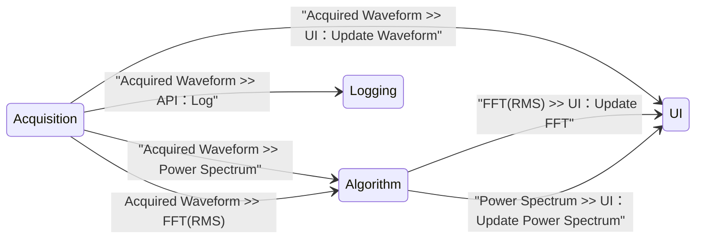

# CSM Continuous Measurement and Logging

[English](./README.md) | [中文](./README(CN).md)

[](https://www.vipm.io/package/nevstop_lib_csm_continuous_meausrement_and_logging_example/)
[](https://www.vipm.io/package/nevstop_lib_csm_continuous_meausrement_and_logging_example/)
[](https://github.com/NEVSTOP-LAB/CSM-Continuous-Meausrement-and-Logging/releases)
[](https://opensource.org/licenses/Apache-2.0)

A simpler, more intuitive, and elegant approach to implementing Continuous Measurement and Logging applications using the CSM (Communicable State Machine) framework.

## Reusable Modules

### `Logging Module`: Logging 1D Waveform Data to TDMS File

| API | Description | Arguments | Response |
| --- | --- | --- | --- |
| `API: Update Settings` | Configuration API | Full path of data folder <br/> (Type: `Plain String`) | N/A |
| `API: Start` | Start logging. Creates a time-based named TDMS file in the data folder. | N/A | N/A |
| `API: Log` | Log data to the TDMS file. | 1D Waveform array.  <br/> (Type: `massdata`) | N/A |
| `API: Stop` | Stop logging. | N/A | N/A |

**Example: (Suppose module name is "Logging")**

``` text
API: Update Settings >> c:\_data -> Logging
API: Log >> MassData-Start:89012,Size:1156 -> Logging
API: Start -> Logging
API: Stop -> Logging
```

### Data Acquisition (DAQ) Module 
	  
| API | Description | Arguments | Response |
| --- | --- | --- | --- |
| `API: Start` | Start data generation every 200ms. | N/A | N/A |
| `API: Stop` | Stop data generation. | N/A | N/A |

| Status | Description | Arguments |
| --- | --- | --- | 
| Acquired Waveform | Simulated Data.  | 1D Waveform array. <br/> (Type: `MassData`) |

The front panel of the module VI is used for configuration.

#### `Acquisition Module` : Generate Sine/Square Simulated signal data


#### `SoundInput-DAQ`: Use your sound card to acquire waveform data.

   

**Example: (Suppose module name is "Acquisition")**

``` text
API: Start -> Acquisition
API: Stop -> Acquisition
```

### `Algorithm Module`: Data Analysis Algorithms for Waveforms

| API | Description | Arguments | Response |
| --- | --- | --- | --- |
| `API: FFT(Peak)` | Analyze waveform with FFT(peak) method | 1D Waveform array. <br/> (Type: `MassData`) | 1D Cluster(waveform) Array. <br/> (Type: `MassData`) |
| `API: FFT(RMS)` | Analyze waveform with FFT(RMS) method | 1D Waveform array. <br/> (Type: `MassData`) | 1D Cluster(waveform) Array. <br/> (Type: `MassData`) |
| `API: Power Spectrum` | Get Power Spectrum of Waveform | 1D Waveform array. <br/> (Type: `MassData`) | 1D Cluster(waveform) Array. <br/> (Type: `MassData`) |

## Continuous Measurement and Logging Application

`Logging Module` and `Acquisition Module` are designed to operate independently without any direct knowledge of each other. For a complete Continuous Measurement and Logging application, a user interface module is required to coordinate their activities. For simplicity (and to facilitate comparison with the Workers framework), the UI Module also serves as the application controller.

When you need to use real hardware for data acquisition, simply create another CSM module for your specific hardware that implements the same API and status interface, then replace the `Acquisition Module` in the UI module.

### UI Module

Create a UI similar to the [Workers Continuous Measurement and Logging Example](https://www.vipm.io/package/sc_workers_framework_core/)


Create a Block Diagram using the CSM Template. Place the `Logging Module` and `Acquisition Module` as submodules.



