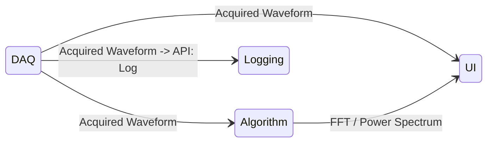

# CSM Continuous Measurement and Logging

[English](./README.md) | [中文](./README(CN).md)

An example project showing how to build a continuous measurement and logging app with CSM (Communicable State Machine), focusing on decoupling, replaceable modules, and clear data flow.

## Why CSM in this repo

- **Loose coupling**: acquisition, algorithm, logging, and UI communicate by message/status routing, not hardcoded references.
- **Hardware replaceability**: keep the same public interface and swap data source modules (for example, simulated DAQ ↔ sound card DAQ).
- **Scalable design**: add new analysis or storage modules without rewriting the existing pipeline.

## Architecture overview

This repo composes four roles:

- **DAQ Source** (`Acquisition` or `SoundInput-DAQ`)
- **Algorithm** (`Algorithm`)
- **Logger** (`Logging`)
- **App Orchestrator/UI** (`UI`)

The key data flow:

```mermaid
stateDiagram-v2
direction LR
DAQ --> Algorithm : Acquired Waveform
DAQ --> Logging : Acquired Waveform -> API: Log
DAQ --> UI : Acquired Waveform
Algorithm --> UI : FFT / Power Spectrum
```

## Module interface docs

Detailed APIs are documented per module (template style):

- [Logging module doc](./_doc/modules/Logging.md)
- [Acquisition module doc](./_doc/modules/Acquisition.md)
- [SoundInput-DAQ module doc](./_doc/modules/SoundInput-DAQ.md)
- [Algorithm module doc](./_doc/modules/Algorithm.md)
- [Module docs index](./_doc/modules/README.md)

## UI variants and differences

This repo provides three UI VIs:

- `UI (Beginner).vi`: easiest to read, explicit wiring and direct teaching-oriented flow.
- `UI (Experienced).vi`: balanced readability and abstraction, suitable as daily project baseline.
- `UI (The Advanced).vi`: most abstract and modular, optimized for reuse/expansion in larger systems.

All three keep the same CSM composition idea; they mainly differ in abstraction level and engineering style.

## Compare with Workers style

A concise comparison note is kept in:

- [Compare with Workers](./_doc/Compare%20with%20Workers.md)

## References

- [CSM Wiki](https://nevstop-lab.github.io/CSM-Wiki/)
- [CSM Module Repo Template](https://github.com/NEVSTOP-LAB/CSM-Module-Repo-Template)
