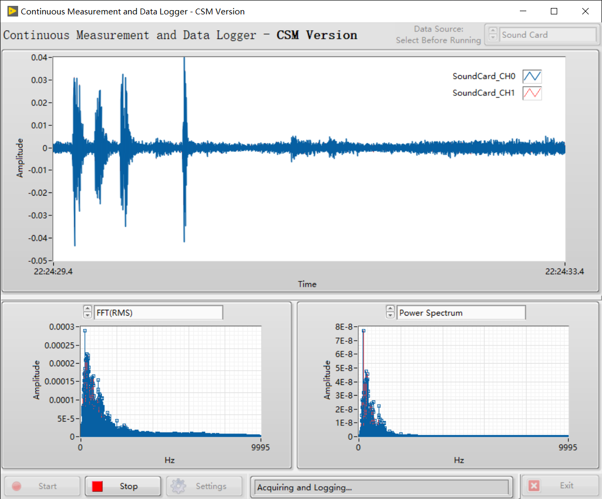

# JKISMPP Continuous Meausrement and Logging

Accomplish application of Continuous Meausrement and Logging with JKISM++. It's much more simple, intuitive and graceful.

## Reusable Modules

### `Logging Module` : Logging 1D Waveform Data to tdms file.

| API | Description | Parameter |
| --- | --- | --- |
| `API: Update Settings` | Config API | Full path of data folder(Type: Plain String) |
| `API: Start` | Start logging. Create the tdms file in data folder with time-based file name. | N/A |
| `API: Log` | Log data to tdms file. | 1D Waveform array.(Type: [MassData Arguments](https://github.com/NEVSTOP-LAB/JKISMPP-MassData-Parameter-Support)) |
| `API: Stop` | Stop logging. | N/A |

**Example: (Suppose module name is "Logging")**
```
API: Update Settings >> c:\_data -> Logging
API: Log >> MassData-Start:89012,Size:1156 -> Logging
API: Start -> Logging
API: Stop -> Logging
```

### `Acquisition Module` : Generate Sine/Square Simulated signal data.

| API | Description | Parameter |
| --- | --- | --- |
| `API: Update Settings` | Config API | Cluster:{HW(String),Signal Type(Enum)} (Type: HexStr) |
| `API: Start` | Start data generation every 200ms. | N/A |
| `API: Stop` | Stop data generation. | N/A |


| Status | Description | Parameter |
| --- | --- | --- |
| Acquired Waveform | Simulated Data.  | 1D Waveform array.(Type: [MassData Arguments](https://github.com/NEVSTOP-LAB/JKISMPP-MassData-Parameter-Support)) |

**Example: (Suppose module name is "Acquisition")**
```
API: Start -> Acquisition
API: Stop -> Acquisition
```

## Continuous Meausrement and Logging Application

`Logging Module` and `Acquisition Module` don't know each other at all. User interface module is needed for Continuous Meausrement and Logging application. To make it sample(and easy to compare with workers), UI Module is also act as the controller of the applciation.

When you need to use real hardare for data aquistion. What you need to do is create another JKISM module for your hardware wtih the same API/Satatus and eplace the `Acquisition Module` in UI module. 


### UI Module

Create UI, which is similar as Workers Continuous Meausrement and Logging Example.



Create Block Diagram with JKISM++ Template. Drop `Logging Module` and `Acquisition Module` as submodules.


#### Start-Up Process (Macro: Initialize)

Initialize data and UI. Load configuration from xml file and send config to submodules. Register "Acquired Waveform" status of "Acquisition" to "UI: Update Waveforms" state of "UI". When "Acquired Waveform" status occurs, "UI" will go to "UI: Update Waveforms" automatically.

```
Data: Initialize
Initialize Core Data
Events: Register
UI: Initialize
UI: Front Panel State >> Open
// Update Settings to submodules
Do: Update Settings
//Update status bar
DO: Update Status >> Ready...
```


#### Exit Process (Macro: Exit)

Stop submodules and UI module itself then.

```
Macro: Exit -@ Acquisition
Macro: Exit -@ Logging
UI: Front Panel State >> Close
Data: Cleanup
Events: Unregister
Exits
```

#### Start Process (Macro: Start)

Update UI and trigger submodule to work with start message. Register "Acquired Waveform" status of "Acquisition" to "API: Log" state of "Logging". When "Acquired Waveform" status occurs, "logging" will go to "API: Log" automatically.


```
DO: Update Status >> Acquiring and Logging...
UI: Update When Start
API: Start ->| Logging
API: Start ->| Acquisition
```


#### Stop Process (Macro: Stop)

Update UI and stop submodules. Unregister "Acquired Waveform" status of "Acquisition".

```
DO: Update Status >> Stoping...
UI: Update When Stop
API: Stop ->| Logging
API: Stop ->| Acquisition
```


