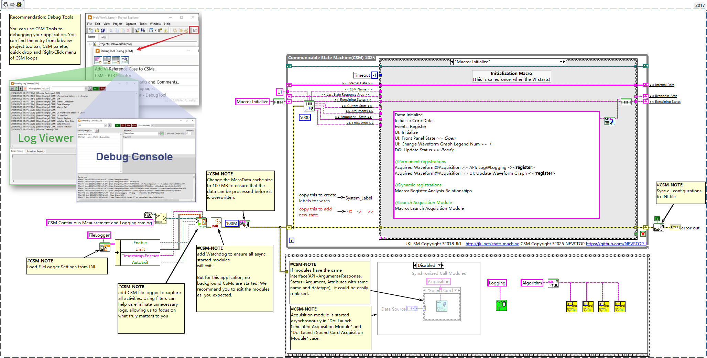

# CSM Continuous Measurement and Logging

[English](./README.md) | [中文](./README(CN).md)

[](https://www.vipm.io/package/nevstop_lib_csm_continuous_meausrement_and_logging_example/)
[](https://www.vipm.io/package/nevstop_lib_csm_continuous_meausrement_and_logging_example/)
[](https://github.com/NEVSTOP-LAB/CSM-Continuous-Meausrement-and-Logging/releases)
[](https://opensource.org/licenses/Apache-2.0)

Accomplish application of Continuous Measurement and Logging with CSM. It's much more simple, intuitive and graceful.

## Reusable Modules

### `Logging Module` : Logging 1D Waveform Data to tdms file

| API | Description | Arguments | Response |
| --- | --- | --- | --- |
| `API: Update Settings` | Config API | Full path of data folder <br/> (Type: `Plain String`) |
| `API: Start` | Start logging. Create the tdms file in data folder with time-based file name. | N/A |
| `API: Log` | Log data to tdms file. | 1D Waveform array.  <br/> (Type: [MassData Arguments](https://github.com/NEVSTOP-LAB/CSM-MassData-Parameter-Support)) |
| `API: Stop` | Stop logging. | N/A |

**Example: (Suppose module name is "Logging")**

``` text
API: Update Settings >> c:\_data -> Logging
API: Log >> MassData-Start:89012,Size:1156 -> Logging
API: Start -> Logging
API: Stop -> Logging
```

### DAQ Module		  
	  
| API | Description | Arguments | Response |
| --- | --- | --- | --- |
| `API: Start` | Start data generation every 200ms. | N/A |
| `API: Stop` | Stop data generation. | N/A |

| Status | Description | Arguments | Response |
| --- | --- | --- | --- |
| Acquired Waveform | Simulated Data.  | 1D Waveform array. <br/> (Type: `MassData`) |

Front panel of the module VI is used for configuration.
#### `Acquisition Module` : Generate Sine/Square Simulated signal data


#### `SoundInput-DAQ` : Use your sound card to aquire waveform.

   

**Example: (Suppose module name is "Acquisition")**

``` text
API: Start -> Acquisition
API: Stop -> Acquisition
```

### `Algorithm Module` : Algorithm on waveform data

| API | Description | Arguments | Response |
| --- | --- | --- | --- |
| `API: FFT(Peak)` | Analyze waveform with FFT(peak) method | 1D Waveform array. <br/> (Type: `MassData`) |
| `API: FFT(RMS)` | Analyze waveform with FFT(RMS) method | HW:(string);Signal Type:(Sine Wave \| 1D Waveform array. <br/> (Type: `MassData`) |
| `API: Power Spectrum` | Get Power Spectrum of Waveform | 1D Waveform array. <br/> (Type: `MassData`) |

## Continuous Measurement and Logging Application

`Logging Module` and `Acquisition Module` don't know each other at all.
User interface module is needed for Continuous Measurement and Logging application.
To make it sample(and easy to compare with workers), UI Module is also acting as the controller of the application.

When you need to use real hardware for data acquisition, create another CSM module for your hardware with the same API/Status and replace the `Acquisition Module` in UI module.

### UI Module

Create UI, which is similar as [Workers Continuous Measurement and Logging Example](https://www.vipm.io/package/sc_workers_framework_core/)


Create Block Diagram with CSM Template. Drop `Logging Module` and `Acquisition Module` as submodules.




